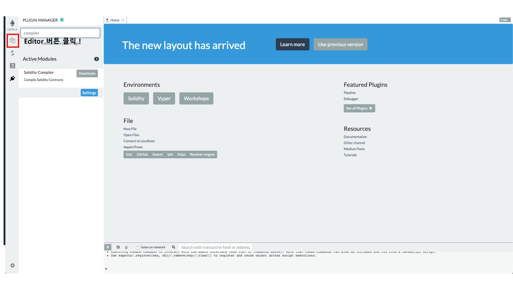

## 자기주도학습 실적

| **학습 형태** | [x]개별 [ ] 2인 1조 [ ] 팀별 |
| ------------- | -------------------------- |
| **구성원** | 오석빈, 윤인제 |
| **일정** | 09:00 ~ 14:00 |
| **데일리 목표** | DAPP 배포를 위한 환경 세팅 |

#### * 주요 내용 요약

-  메타마스크(Metamask)  
  
   -  MetaMask는 이더리움 분산 어플리케이션 또는 Dapps에서 접근을 할 수 있게 해주는 확장프로그램이다.
   -  이더리움을 비롯한 Ropsten,Kovan Rinkeby Goerli등 테스트 네트워크에서 사용할 수 있다.
  
   - 메인화면

- Remix 
    - Smart Contract 개발을 위한 IDE
    - Remix 브라우저 IDE (http://remix.ethereum.org)
    -  Remix는 반드시 메타마스크와 같은 브라우저에서 열어야 함.
    -  사용법
  
     
      
       
        
         
          
           

