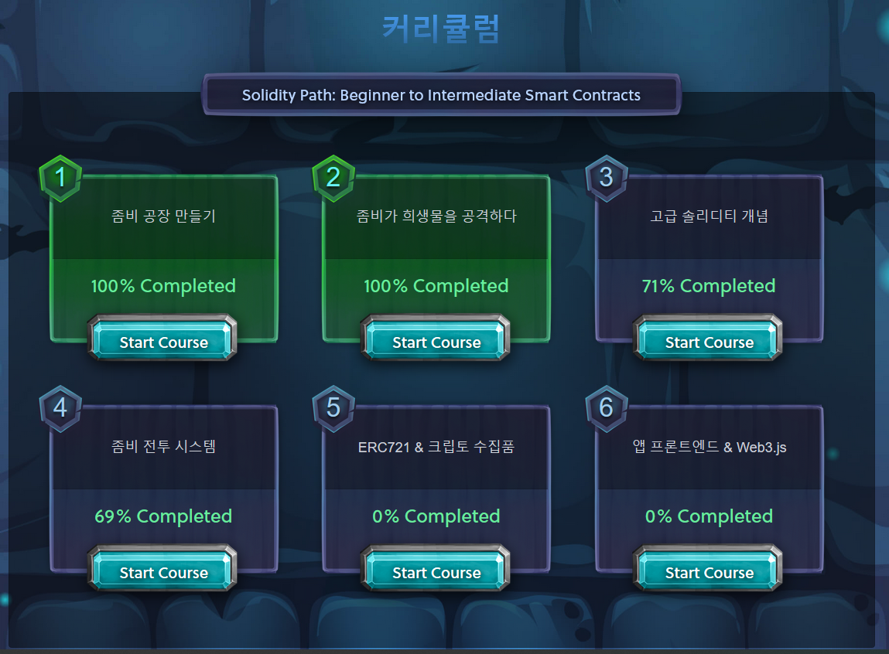

## 자기주도학습 실적

| **학습 형태** | [x]개별 [ ] 2인 1조 [ ] 팀별 |
| ------------- | -------------------------- |
| **구성원** | 오석빈, 윤인제 |
| **일정** | 09:00 ~ 14:00 |
| **데일리 목표** | 블록체인 언어 Solidity 실습 1 |

#### * 주요 내용 요약

- 솔리디티(영어: Solidity)는 계약 지향 프로그래밍 언어로 다양한 블록체인 플랫폼의 스마트계약(Smart Contract) 작성 및 구현에 사용된다.

- 크립토 좀비(https://cryptozombies.io/ko/course)를 통해 solidity 실습

- 커리큘럼은 다음과 같다.
 

- 2장 솔리디티 활용 실스
- 

