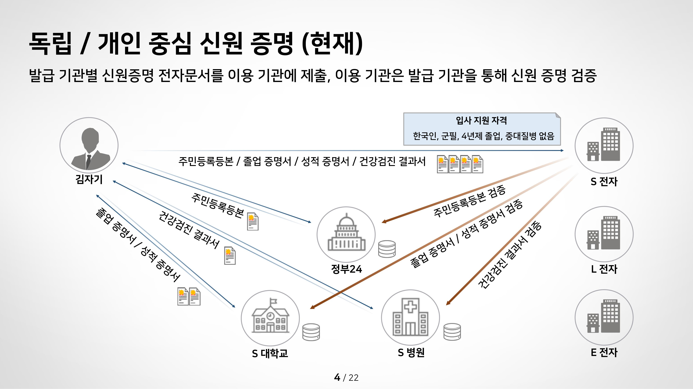
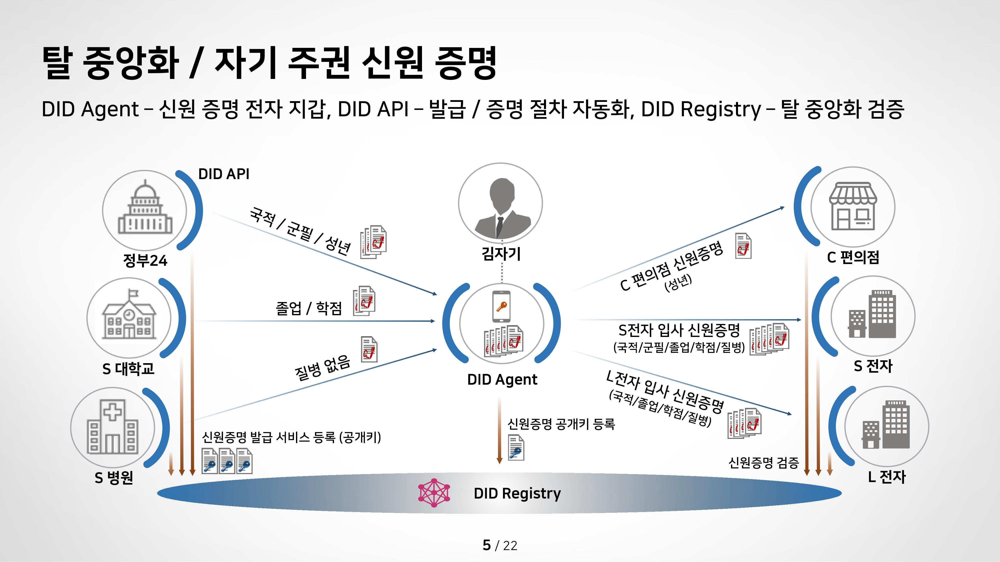
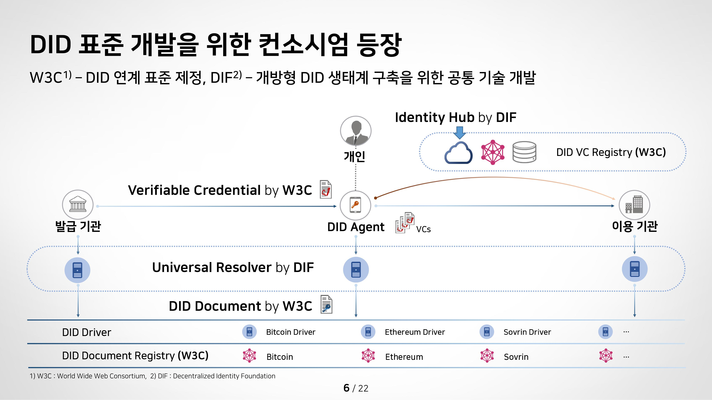
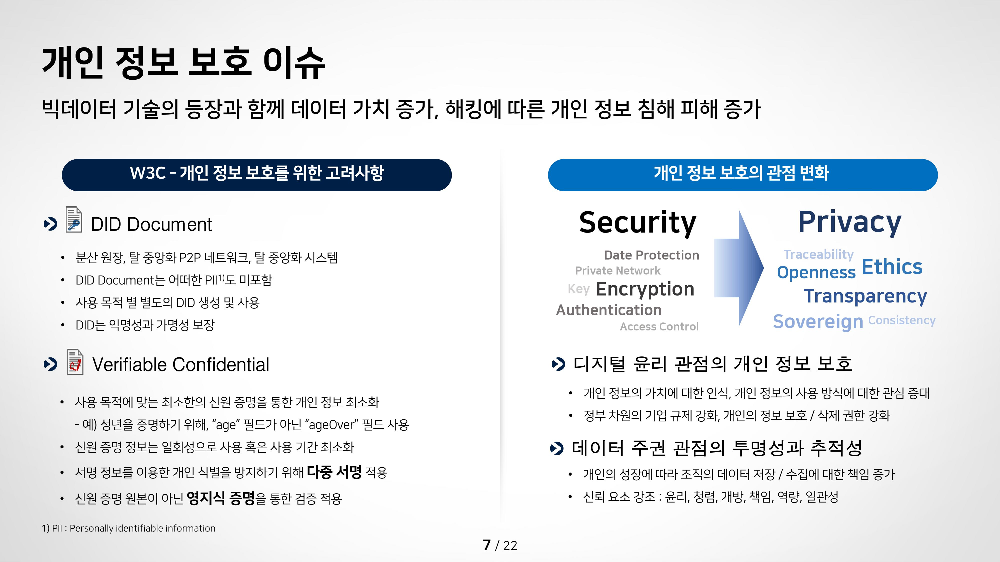

## 자기주도학습 실적

| **학습 형태** | [x]개별 [ ] 2인 1조 [ ] 팀별 |
| ------------- | -------------------------- |
| **구성원** | 오석빈, 윤인제 |
| **일정** | 09:00 ~ 14:00 |
| **데일리 목표** | 향후 프로젝트 개발방향 |

#### * 주요 내용 요약

- 2주간 블록체인 자습을 통해 개발언어와 환경에 대해 습득

- 향후 프로젝트 관심분야에 대해 정리

#### DID(Decentralized Identity)

- 탈중앙화 신원 증명

  - 영국의 모바일 신분증으로 담배 구매 사례
      
  https://blockpost.com/tech/59490/

    - 기존의 인증 방식
  

    - DID 인증 방식
 

    - DID의 구조
  
    - DID의 이슈
  
